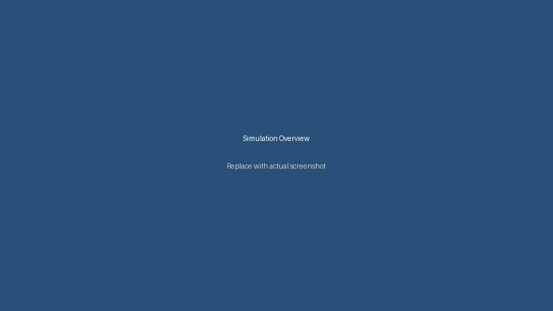
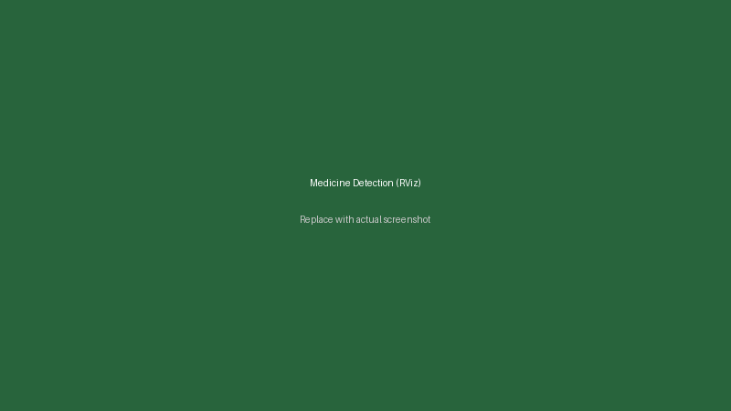
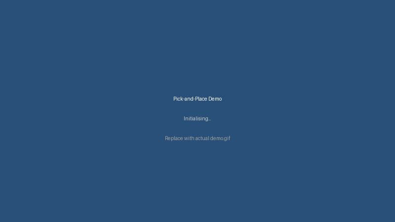

# myCobot 280 Autonomous Medicine Pick-and-Place


A ROS 2 simulation of an **Elephant Robotics myCobot 280** 6-DOF arm performing autonomous pick-and-place of medicine packets from a two-tier shelf. The robot detects medicines from a live Intel RealSense D435 RGBD point cloud, selects the closest target, and executes a collision-free grasp using MoveIt 2.

> **Stack:** ROS 2 Jazzy · Gazebo Harmonic · MoveIt 2 · Python 3.12 · Ubuntu 24.04

---

## Demo

<p align="center">
  
  &nbsp;
  
</p>

<p align="center">
  
</p>

---

## Prerequisites

| Tool | Version |
|---|---|
| Ubuntu | 24.04 LTS |
| ROS 2 | [Jazzy](https://docs.ros.org/en/jazzy/Installation.html) |
| Gazebo | [Harmonic](https://gazebosim.org/docs/harmonic/install) |
| Python | 3.12 |

---

## Installation

### 1. Create a workspace and clone

```bash
mkdir -p ~/class_ws/src
cd ~/class_ws/src
git clone https://github.com/asrafulapu1996/ros2_shelf_shared_autonomy.git .
```

### 2. Install ROS 2 dependencies with rosdep

```bash
cd ~/class_ws
rosdep update
rosdep install --from-paths src --ignore-src -r -y
```

### 3. Install Python dependencies not covered by rosdep

```bash
pip3 install pymoveit2
```

> `pymoveit2` provides the Python MoveIt 2 interface used by the picker node and is not yet available through rosdep. All other Python dependencies (`numpy`, `opencv-python`, `scikit-learn`) are installed by rosdep in step 2.

### 4. Build the workspace

```bash
cd ~/class_ws
colcon build --symlink-install
```

### 5. Source the workspace

```bash
source ~/class_ws/install/setup.bash
```

Add to `~/.bashrc` to avoid repeating this step:

```bash
echo "source ~/class_ws/install/setup.bash" >> ~/.bashrc
```

---

## Running the Project

Open **5 terminals** and run each command in order. Wait for Terminal 1 and 2 to be fully ready before starting the rest.

### Terminal 1 — Gazebo Simulation

```bash
source /opt/ros/jazzy/setup.bash && cd ~/class_ws && source install/setup.bash && ros2 launch mycobot_gazebo mycobot.gazebo.launch.py use_camera:=true
```

Wait until the world is loaded, the robot is spawned, and the arm moves to the home pose (~15 seconds).

### Terminal 2 — MoveIt 2 + RViz

```bash
source /opt/ros/jazzy/setup.bash && cd ~/class_ws && source install/setup.bash && ros2 launch mycobot_moveit_config move_group.launch.py
```

Wait until you see **`"Ready to take commands"`** in the terminal output before proceeding.

### Terminal 3 — Input Device (gamepad or keyboard)

**Option A — Gamepad** (connects a physical joystick):

```bash
source /opt/ros/jazzy/setup.bash && cd ~/class_ws && source install/setup.bash && ros2 launch mycobot_moveit_demos gamepad_teleop.launch.py
```

**Option B — Keyboard** (full arm teleoperation + pick trigger, no gamepad needed):

```bash
source /opt/ros/jazzy/setup.bash && cd ~/class_ws && source install/setup.bash && ros2 run picker keyboard_trigger
```

Keyboard controls:

| Key | Action |
|---|---|
| `W` / `S` | Move EEF +X / -X (10 mm) |
| `A` / `D` | Move EEF +Y / -Y (10 mm) |
| `Q` / `E` | Move EEF +Z / -Z (10 mm) |
| `Z` / `X` | Rotate base joint +/- 5.7° |
| `O` | Open gripper |
| `C` | Close gripper |
| `H` | Go to home position |
| `P` | Print current EEF pose |
| `Enter` | Trigger pick-and-place / confirm release |
| `ESC` | Quit |

### Terminal 4 — Medicine Detector

```bash
source /opt/ros/jazzy/setup.bash && cd ~/class_ws && source install/setup.bash && ros2 run picker medicine_detector
```

Detected medicines appear as **green** (target) and **orange** (others) bounding boxes in the RViz camera overlay on topic `/medicine_detection_image`.

### Terminal 5 — Picker Node

```bash
source /opt/ros/jazzy/setup.bash && cd ~/class_ws && source install/setup.bash && ros2 run picker picker_node
```

Wait for the log: `Picker ready. Start medicine_detector then press Start.`

---

## How to Use

Once all 5 terminals are running:

1. **Press Start** on the gamepad (button 7) — or press **Enter** if using the keyboard
2. The robot picks the closest detected medicine and carries it to the table drop position
3. The robot holds the medicine and waits — log shows: `Holding medicine at drop position. Open gripper manually then press Start to go home.`
4. Open the gripper (press `O` on keyboard, or run the command below)
5. **Press Start / Enter again** — the arm returns home

### Manually open the gripper from a separate terminal

```bash
ros2 action send_goal /gripper_action_controller/gripper_cmd \
  control_msgs/action/GripperCommand \
  "{command: {position: 0.0, max_effort: 50.0}}"
```

---

## Package Overview

```
src/
├── apps/
│   └── picker/                        # Pick-and-place application (Python)
│       └── picker/
│           ├── medicine_detector.py       ← DBSCAN-based RGBD detector
│           ├── picker_node.py             ← motion controller
│           ├── keyboard_trigger.py        ← keyboard teleop + pick trigger
│           └── keyboard_selector.py       ← keyboard target selector
│
├── core/
│   └── mycobot_description/           # URDF/xacro robot model + meshes
│
├── planning/
│   └── mycobot_moveit_config/         # MoveIt 2 SRDF, kinematics, controllers
│
├── simulation/
│   └── mycobot_gazebo/                # Gazebo world, SDF models, ROS-GZ bridge
│
└── examples/
    └── mycobot_moveit_demos/          # Gamepad & keyboard teleop demos (C++)
```

---

## Configuration

All tunable parameters are at the top of [src/apps/picker/picker/picker_node.py](src/apps/picker/picker/picker_node.py):

| Parameter | Default | Description |
|---|---|---|
| `GRIPPER_REACH` | `0.120` m | Distance offset from `link6_flange` to stop before the medicine face. Increase to grasp earlier; decrease to reach deeper |
| `STAGING_Y` | `0.10` m | Safe Y position in front of the shelf for all lateral moves |
| `CLEAR_Y` | `-0.05` m | Y position the arm retracts to before the joint-space move to the drop position |
| `TABLE_DROP_POS` | `[0.208, 0.091, 0.108]` | World-frame `link6_flange` XYZ at the table drop position |
| `CART_SPEED` | `0.04` m/s | Speed for all Cartesian straight-line moves |

### Re-tracing the drop position

Move the arm to the desired drop position, then read the live TF:

```bash
ros2 run tf2_ros tf2_echo world link6_flange
```

Copy the `Translation: [x, y, z]` into `TABLE_DROP_POS` and rebuild:

```bash
cd ~/class_ws && colcon build --packages-select picker --symlink-install
```

---

## Key ROS 2 Interfaces

| Topic / Action / Service | Type | Description |
|---|---|---|
| `/joy` | `sensor_msgs/Joy` | Gamepad / keyboard trigger input |
| `/target_medicine_pose` | `geometry_msgs/PoseStamped` | Closest detected medicine pose |
| `/detected_medicines_markers` | `visualization_msgs/MarkerArray` | RViz bounding-box overlays |
| `/medicine_detection_image` | `sensor_msgs/Image` | Annotated colour image |
| `/camera_head/depth/color/points` | `sensor_msgs/PointCloud2` | Input point cloud |
| `/arm_controller/joint_trajectory` | `trajectory_msgs/JointTrajectory` | Cartesian path execution |
| `/gripper_action_controller/gripper_cmd` | `control_msgs/action/GripperCommand` | Gripper open/close |
| `/compute_cartesian_path` | `moveit_msgs/srv/GetCartesianPath` | Straight-line path planning |

---

## Troubleshooting

**Planning fails / arm freezes**
MoveIt is configured for 5 s planning time and 10 attempts per call. Make sure Terminal 2 shows `"Ready to take commands"` before pressing Start.

**No medicines detected**
Check the point cloud is arriving:
```bash
ros2 topic hz /camera_head/depth/color/points
```

**Arm collides with shelf during drop move**
Decrease `CLEAR_Y` (e.g. `-0.10`) so the arm pulls further back before the joint-space move to the drop position.

**Wrong gamepad button**
Check the button index with `ros2 topic echo /joy` then run:
```bash
ros2 run picker picker_node --ros-args -p grasp_button_index:=9
```

---

## License

BSD-3-Clause — see [LICENSE](LICENSE) for details.
